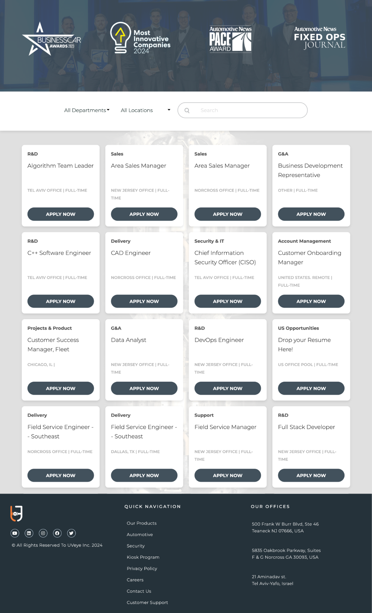

## The UVeye Career Portal
**© All rights reserved to UVeye INC.**

UVeye is a computer vision company that develops automated inspection systems for vehicles, powered by artificial intelligence and proprietary hardware. Deployed at over 400 locations worldwide, UVeye is trusted by industry leaders like General Motors, Amazon, Volvo Cars, Carmax, and more.

**GitHub page:**  
[https://toulouse6.github.io/uveye-careers/](https://toulouse6.github.io/uveye-careers/)

**Live on UVeye.com:**  
[https://www.uveye.com/careers/](https://www.uveye.com/careers/)

---

### Key Features:

- **Job Listings:** Display current job openings with detailed descriptions.

- **Comeet API Integration**

---

### Technologies:

- **JavaScript ES6**  
- **PHP**  
- **CSS3**  
- **HTML5**  
- **WordPress**  
- **Elementor**  
- **Comeet Widget**
